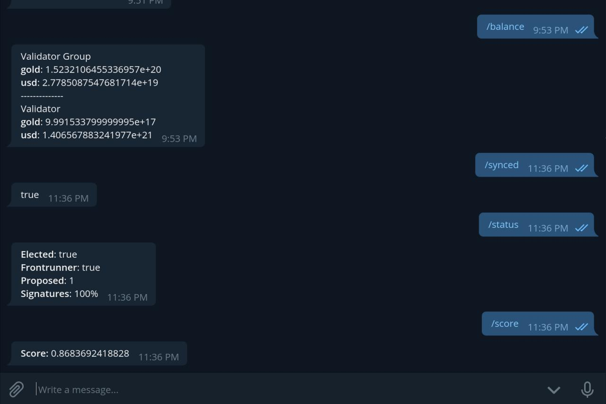

# Celocli Wrapper

### Instructions
1. `$ git clone https://github.com/jim380/node_tooling` into your `$GOPATH/src/github.com`
2. `$ cd node_tooling/Celo`
3. `$ go get`
4. `$ touch config.env` , then fill in your environment variables in it. Check `config.env.example` for reference.
5. `$ go build`
6. `$ ./Celo`

#### Run Node Set-Up
- `$ ./Celo`

##### Sample Outputs
* [Account](https://pastebin.com/aRW2Txv3)
* [Validator](https://pastebin.com/Zq6PrFg5)
* [Proxy](https://pastebin.com/Bbg8NnFh)
* Attestation --- TODO

#### Run Celocli Wrapper
- `$ ./Celo -cmd`

- Menu:
    1. Election Show
        - `election:show`
    2. Account Balance
        - `account:balance`
        - `lockedgold:lock`
        - `exchange:dollars`
    3. Account Show
        - `account:show`
    4. Lockgold Show
        - `lockedgold:show`
        - `election:vote`
    5. Validator Show
        - `validator:show`
    6. Validator Status
        - `validator:status`
    7. Get Metadata
        - `account:get-metadata`
    8. Node Synced
        - `node:synced`
    9. More to add
##### Sample Outputs
* [Wrapper](https://pastebin.com/6nt2XGCD)

#### Run Telegram Bot
- `$ ./Celo -bot`
- Menu
    1. Balance (`account:balance`)
    2. Synced (`node:synced`)
    3. Status (`validator:status`)
    4. Score (`lockedgold:show`)
    5. More to add

