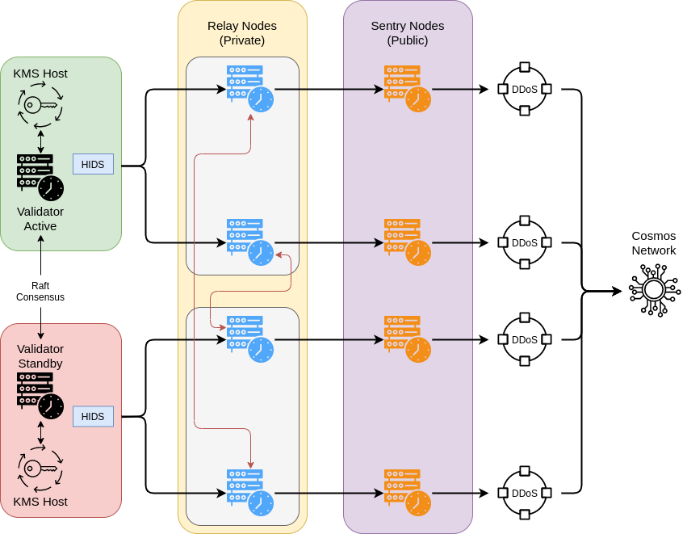

# Instructions

## Summary
- This doc uses [Band Protocol](https://bandprotocol.com/) as an example
- Full infrastructure-as-code is beyond the scope of this tutorial
- A high-level overview of our preferred architectural design can be found below



## Prerequisite
Download Terraform [binary](https://www.terraform.io/downloads.html)  and install it.

## Initialization
- Download binaries and genesis file, then place them in `cosmos_boilerplate/files`
- Fill in your AWS api keys and change protocol-specific parameters in `cosmos_boilerplate/vars.tf`
- Tweak security group rules in `cosmos_boilerplate/security_group.tf`
- Tweak whatever tf you need

## Deployment
```
$ terraform init # under ava/
$ ssh-keygen -f terra # save a copy of the private key
$ terraform validate # check syntax
# terraform plan # dryrun
$ terraform apply # deploy
```

## Monitoring
```
$ sudo systemctl status bandd
$ tail -f /var/log/bandd.log
```
**NOTE: No tendermint node keys will be added during the deployment. You need to do that on your own, first thing when you log on to server.**
```
$ bandcli keys add <key_name>
```
## Termination
```
$ terraform destroy
```